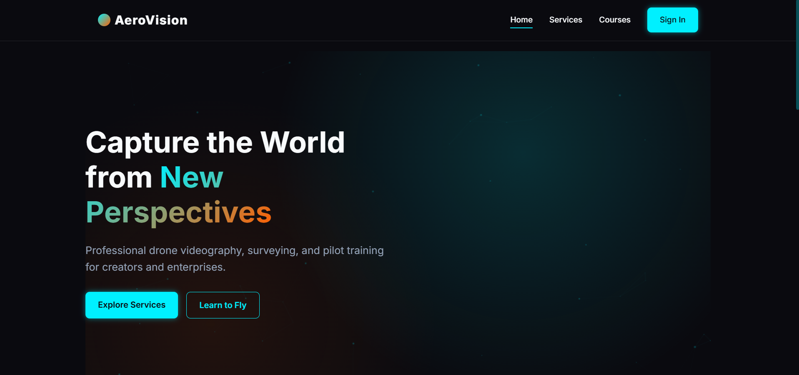
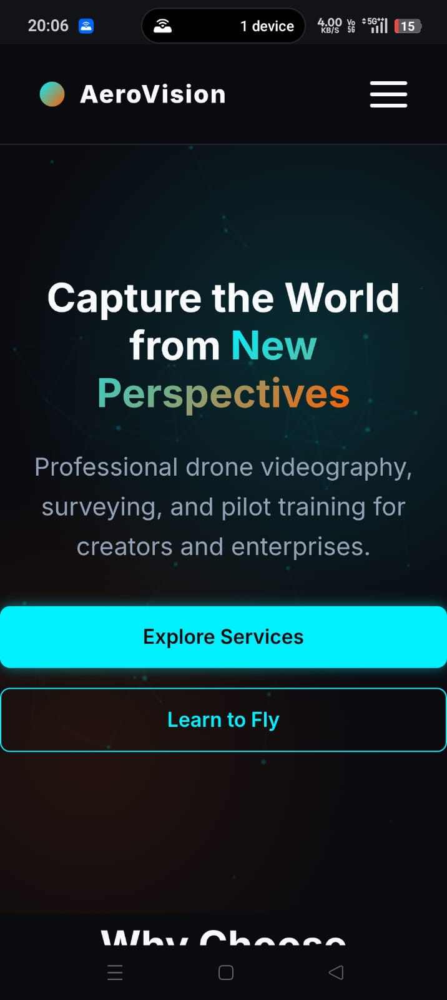

# UIUX_Frontend_Task_Soham_Banerjee

This repository contains my practical test assignment for the **UI/UX Designer & Frontend Developer Internship** at **IPAGE Group**. The objective of this project was to completely redesign and build the front-end for the DroneTV website.

## 📖 Project Description

This project is a modern, responsive redesign of the DroneTV website. It is built strictly from a custom Figma design and encompasses the following 5 distinct pages:

1. **Home** (`index.html`) - A cinematic landing page highlighting premium drone services and courses.
2. **Services** (`services.html`) - A detailed grid layout showcasing industrial drone solutions.
3. **Courses** (`courses.html`) - A pricing and feature tier overview for drone piloting courses.
4. **Login** (`login.html`) - A sleek, glassmorphic authentication interface.
5. **User Dashboard** (`dashboard.html`) - A complex layout featuring a navigation sidebar, high-level statistics, and a recent activity log.

## 🛠️ Technologies Used

The project was built adhering strictly to core web technologies to demonstrate strong fundamental front-end skills. **No external frameworks, UI libraries (like Bootstrap or Tailwind), or JavaScript libraries (like React or Vue) were used.**

*   **HTML5:** Semantic structuring and accessible layout.
*   **CSS3:** Custom CSS variables for a unified design system, glassmorphism effects, flexbox/grid layouts, and responsive media queries.
*   **Vanilla JavaScript (ES6+):** Interactive mobile hamburger menu, dynamic active link highlighting, scroll reveal animations, and advanced hover states (3D card tilt & button ripples).

## 🚀 How to Run the Project

Since this is a static website, you do not need any backend setup or build tools to run it. 

### Option 1: Direct File Open
1. Clone this repository to your local machine:
   ```bash
   git clone https://github.com/sohambanerjee314-star/UIUX_Frontend_Task_Soham_Banerjee.git
   ```
2. Navigate to the project folder.
3. Simply double-click `index.html` to open it in your default web browser.

### Option 2: Using VS Code Live Server (Recommended)
1. Open the project folder in Visual Studio Code.
2. Install the **Live Server** extension if you haven't already.
3. Right-click on `index.html` and select **"Open with Live Server"**.
4. The website will automatically launch and reload upon any changes.

## 📸 Screenshots

*(Desktop and Mobile previews of the redesign)*

**Desktop View:**


**Mobile View:**


## 🔗 Important Links

*   **Figma Design Link:** [[Insert Figma Link Here]]
*   **Live Demo Link:** [[Insert Live Demo Link Here]]

---
*Designed and developed by Soham Banerjee.*